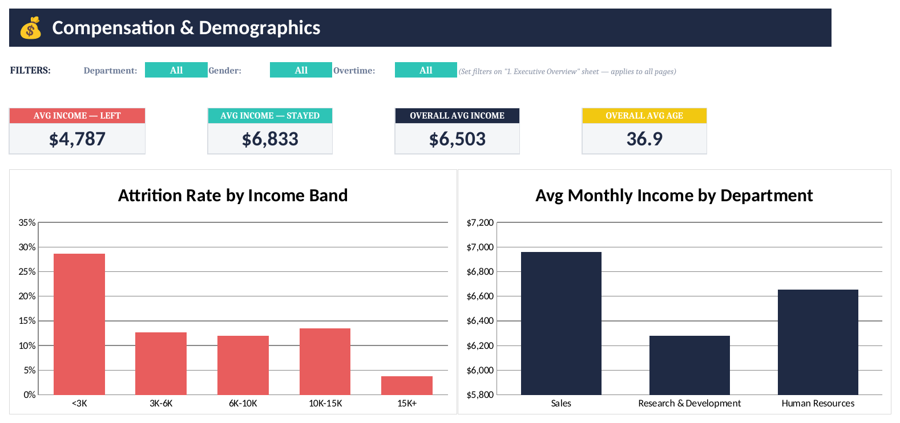
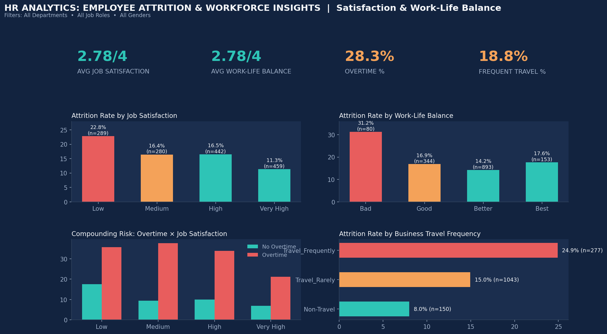
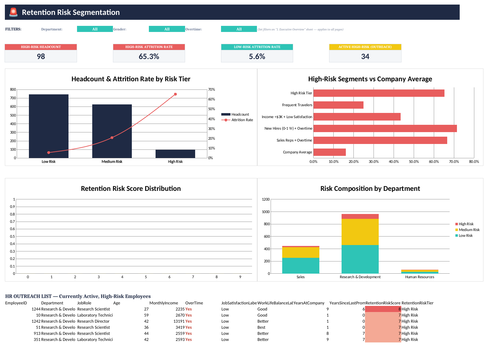

# HR Analytics: Employee Attrition & Workforce Insights

**A SQL + Excel portfolio project analyzing employee attrition, workforce trends, job
satisfaction, compensation, and retention risk — built on a real, industry-standard HR dataset.**


---

## Project Overview

This project analyzes the well-known **IBM HR Analytics Employee Attrition & Performance
dataset** (1,470 employees) to answer a question every HR and business leader cares about: *who is
leaving, why, and who's likely to leave next?*

It's built the way a data analyst would actually deliver this work end to end:
1. **SQL** — clean, validate, and transform raw HR data into an analysis-ready table
2. **SQL** — explore the workforce and quantify what drives attrition
3. **Excel** — turn the analysis into an interactive, filterable executive dashboard
4. **Business documentation** — translate findings into recommendations a non-technical
   stakeholder can act on

## Business Problem

The organization has seen a rising number of resignations without a clear, data-driven view of
where attrition concentrates or which active employees are most at risk. Attrition is expensive —
replacing an employee typically costs 50%–200% of their annual salary in recruiting, onboarding,
and lost productivity. Using a conservative six-month-salary cost basis, the 237 departures in this
dataset represent an **estimated $6.9M+ in annual replacement cost**.

Full write-up: [`docs/business_problem.md`](docs/business_problem.md)

**Key business questions answered:**
- What is the overall attrition rate, and how does it vary by department and job role?
- Does overtime meaningfully increase attrition risk?
- How does compensation relate to attrition?
- How does tenure relate to attrition risk?
- Do satisfaction and work-life balance predict attrition?
- Which specific employee segments carry the highest combined risk?
- Which currently active employees should HR check in with first?

## Dataset

- **Source:** IBM HR Analytics Employee Attrition & Performance dataset (public, fictional data
  created by IBM data scientists for analytics education — no real personal data)
- **Size:** 1,470 employees × 35 original fields, expanded to 46 fields after cleaning/enrichment
- **Fields include:** Employee ID, Age, Gender, Department, Job Role, Education, Marital Status,
  Monthly Income, Overtime, Business Travel, Job Satisfaction, Performance Rating, Years at
  Company, Years Since Last Promotion, Attrition, and more
- **Files:**
  - `data/HR_Employee_Attrition_raw.csv` — untouched source data
  - `data/HR_Employee_Attrition_cleaned.csv` — cleaned, enriched, analysis-ready (used by SQL + Excel)

Full field-by-field reference: [`docs/data_dictionary.md`](docs/data_dictionary.md)

## Tech Stack

| Layer | Tools |
|---|---|
| Data cleaning & transformation | SQL (PostgreSQL/MySQL syntax) |
| Exploratory & statistical analysis | SQL |
| Dashboard & visualization | Excel (formulas, PivotTable-style aggregation, charts) |
| Supporting data prep / visuals | Python (pandas, matplotlib) |
| Documentation | Markdown |

## SQL Analysis

All SQL lives in `/sql` and is organized the way a real analytics pipeline is structured:

| File | Purpose |
|---|---|
| `schema.sql` | Table definitions for the raw staging table and the cleaned analytics table |
| `data_cleaning.sql` | Validation checks, column drops, ordinal-scale decoding, feature engineering (bands, retention risk score) |
| `exploratory_analysis.sql` | Headcount, demographics, distributions — understanding the workforce before touching attrition |
| `attrition_analysis.sql` | Department/role/overtime/salary/tenure/satisfaction/promotion attrition breakdowns, plus compounding-risk segment queries |
| `kpi_queries.sql` | Every KPI shown on the dashboard, as standalone queries that reconcile 1:1 with the Excel workbook's formulas |

All 57 queries across these five files were tested end-to-end against the real dataset before being
committed to this repo.

## Excel Dashboard

The dashboard lives in a single, self-contained workbook —
[`excel/HR_Attrition_Interactive_Dashboard.xlsx`](excel/HR_Attrition_Interactive_Dashboard.xlsx) —
with no add-ins, macros, or external tools required. It's organized into four pages plus a cover
sheet, the full dataset, and a hidden formula engine ("Calc") that powers every KPI card and chart.

**Interactive filters** (synced across all pages): three dropdowns — Department, Gender, and
Overtime — live at the top of the "1. Executive Overview" tab. Every KPI card, chart, and table on
every page recalculates instantly from those three controls using `SUMPRODUCT`-based formulas
against the full 1,470-row dataset — no PivotTables or Power Query required, so it opens and
filters instantly in any modern version of Excel.

### Page 1 — Executive Overview
KPI cards (Total Employees, Attrition Rate, Active Employees, Avg Monthly Income), attrition
donut, attrition rate by department, overtime impact, attrition rate by job role, attrition rate
by tenure.


### Page 2 — Compensation & Demographics
Income vs. attrition analysis, department pay comparison, age band headcount + attrition trend,
marital status attrition.



### Page 3 — Satisfaction & Work-Life Balance
Job satisfaction and work-life balance vs. attrition, a compounding-risk view (overtime × job
satisfaction), business travel impact.



### Page 4 — Retention Risk Segmentation
Risk-tier headcount and attrition rate, named highest-risk segments vs. company average, risk
score distribution, risk composition by department, and a drill-through table of currently active
high-risk employees for HR outreach.



## Key Findings

- **Overall attrition rate: 16.12%** (237 of 1,470 employees)
- **Overtime is the strongest single driver:** 30.5% attrition for employees who work overtime vs.
  10.4% for those who don't — nearly 3x
- **Sales has the highest departmental attrition (20.6%)**, and **Sales Representatives churn at
  39.8%** — the highest of any role company-wide
- **The first two years are the highest-risk period:** new hires attrite at 36.4%, dropping to
  13.8% by year 3-5 and 8.1% after year 10
- **Compensation risk concentrates at the bottom:** employees earning under $3,000/month leave at
  28.6%, nearly 8x the rate of top earners ($15K+: 3.8%)
- **Risk factors compound:** Sales Representatives who work overtime leave at **66.7%** — two out
  of every three. A rule-based Retention Risk Score built from these compounding factors shows
  **65.3% attrition for "High Risk" employees vs. 5.6% for "Low Risk"** — a 12x spread

Full findings and the methodology behind the risk score: [`docs/business_insights.md`](docs/business_insights.md)

## Business Recommendations

1. Audit overtime practices in Sales, starting with Sales Representatives — the single
   highest-leverage segment in the data
2. Build a structured 0-24 month onboarding and check-in program to address front-loaded early-tenure attrition
3. Review the compensation floor (sub-$3,000/month) rather than an across-the-board raise
4. Use the Retention Risk Score as a standing, proactive HR outreach list — not just historical reporting
5. Re-examine business travel policy for frequent travelers (24.9% vs. 8.0% attrition)

Full recommendations: [`docs/business_insights.md`](docs/business_insights.md)

## Repository Structure

```
hr-analytics-employee-attrition-dashboard/
│
├── data/
│   ├── HR_Employee_Attrition_raw.csv        # Untouched source data (1,470 rows, 35 fields)
│   └── HR_Employee_Attrition_cleaned.csv    # Cleaned & enriched (46 fields) — used by SQL + Excel
│
├── sql/
│   ├── schema.sql                # Table definitions
│   ├── data_cleaning.sql         # Validation + cleaning + feature engineering
│   ├── exploratory_analysis.sql  # Workforce EDA
│   ├── attrition_analysis.sql    # Attrition deep-dive + risk segments
│   └── kpi_queries.sql           # Dashboard KPI source-of-truth queries
│
├── excel/
│   └── HR_Attrition_Interactive_Dashboard.xlsx  # Interactive Excel dashboard (4 pages + data + engine)
│
├── images/
│   ├── 01_executive_overview.png
│   ├── 02_compensation_demographics.png
│   ├── 03_satisfaction_worklife.png
│   └── 04_retention_risk_segmentation.png
│
├── docs/
│   ├── business_problem.md       # Business context, cost of attrition, key questions
│   ├── data_dictionary.md        # Full field reference + risk score methodology
│   └── business_insights.md      # Findings + recommendations
│
├── README.md
├── requirements.txt
└── LICENSE
```

## How to Reproduce This Project

1. **Load the data:** Run `sql/schema.sql`, then load `data/HR_Employee_Attrition_raw.csv` into
   `employees_raw`, then run `sql/data_cleaning.sql` to populate the `employees` analytics table
   (or just use the pre-built `data/HR_Employee_Attrition_cleaned.csv` directly).
2. **Explore:** Run `sql/exploratory_analysis.sql` and `sql/attrition_analysis.sql` against your
   database of choice (PostgreSQL, MySQL, or SQLite).
3. **Open the dashboard:** Open `excel/HR_Attrition_Interactive_Dashboard.xlsx` directly — the
   four dashboard pages, KPIs, and charts are already built and update live from the Department /
   Gender / Overtime filters on the "1. Executive Overview" tab.
4. **(Optional) Regenerate the preview visuals:** `pip install -r requirements.txt`, then the
   plotting logic in this repo's history can be adapted to regenerate the `/images` previews from
   the cleaned CSV.

## Future Improvements

- Add a proper time dimension (hire date / termination date) to support true time-series attrition
  trending, rather than point-in-time snapshots
- Layer in a machine learning classification model (e.g., logistic regression or gradient boosting)
  as a comparison point against the transparent rule-based Retention Risk Score
- Track manager-level attrition using `YearsWithCurrManager` to identify manager-specific retention
  patterns
- Connect the workbook to a live HRIS data source (e.g. via Power Query) for scheduled refresh
- Add exit-interview text data and apply basic text analytics to validate the quantitative risk
  drivers found here

---

*This project uses a publicly available, fictional dataset for educational/portfolio purposes. No
real employee data was used.*
